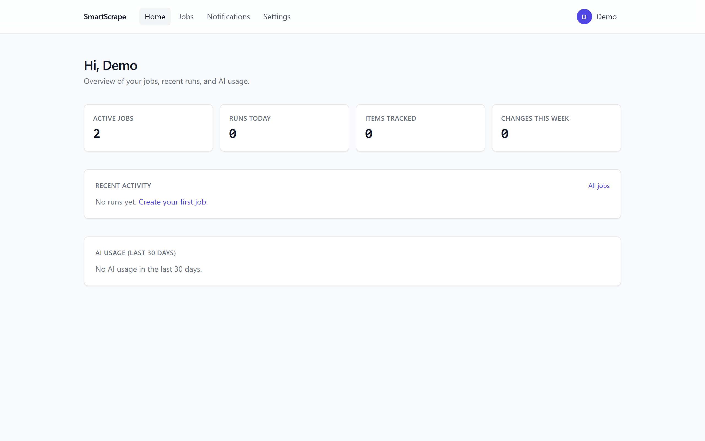
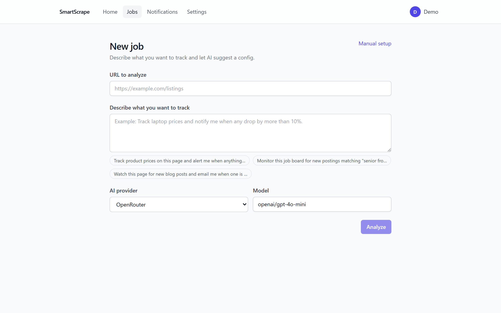
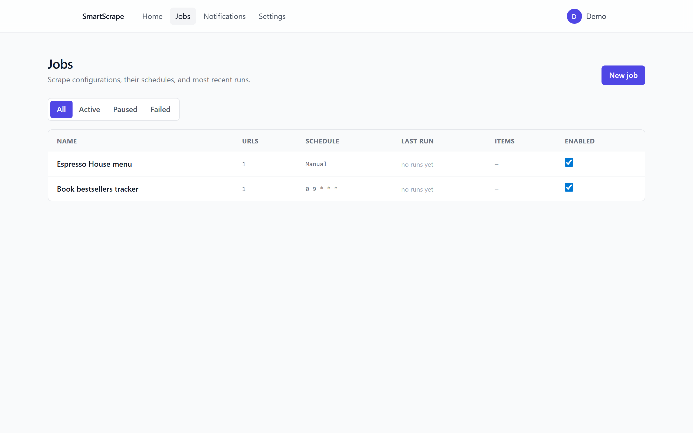
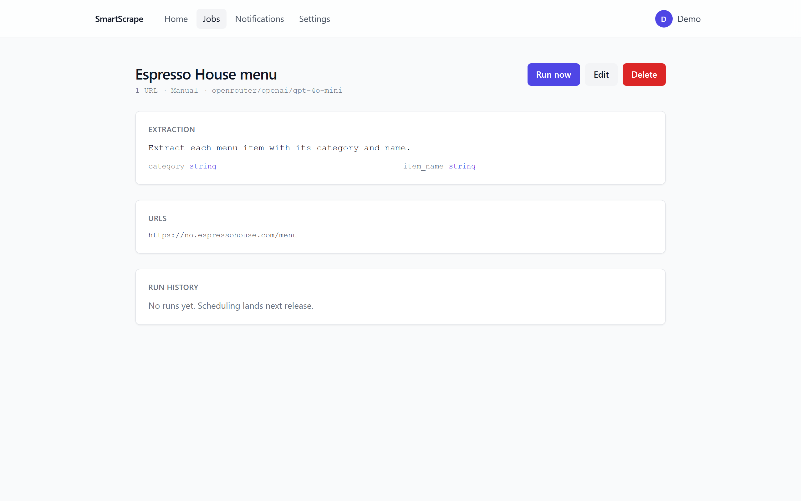
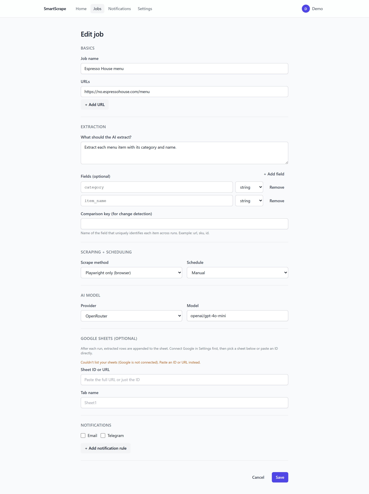
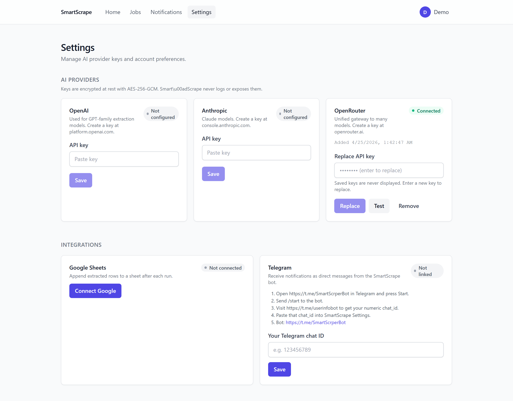
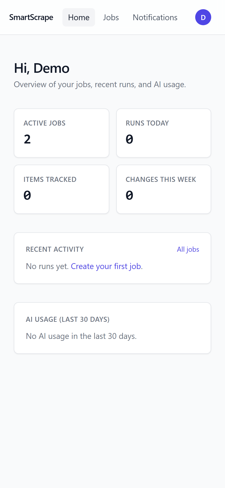
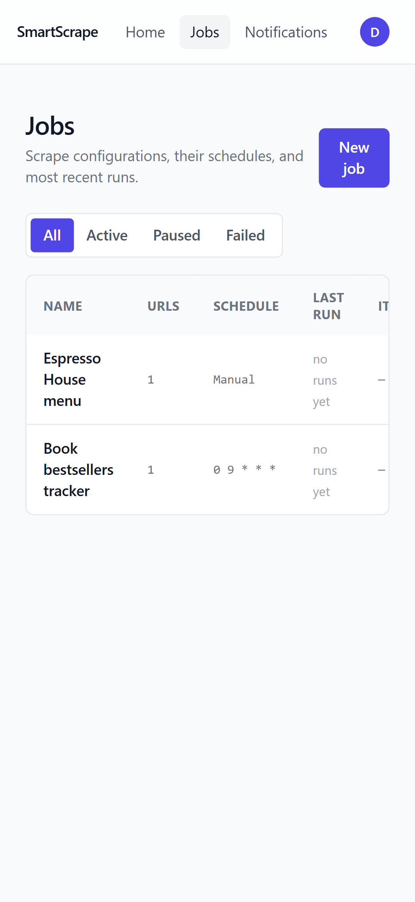

# SmartScrape

[](https://github.com/9ny4/smartscrape/actions/workflows/ci.yml)
[](LICENSE)


Self-hosted AI-powered web scraping. Tell it what you want to track in plain English, and it turns any page into structured data, watches for changes, and notifies you by email or Telegram. Bring your own API key from OpenAI, Anthropic, or OpenRouter — SmartScrape never ships with keys or phones home.



## What it's good at

- **Ask for what you want in plain English.** "Track laptop prices and alert me on drops > 10%" becomes a full scrape config with extraction schema, comparison key, and notification rules.
- **JS-rendered pages handled.** Static HTML with Cheerio when it works, headless Chromium (Playwright) when it doesn't — auto-detected.
- **Change detection that's useful.** SHA-256 hashes per row, matched across runs by a user-chosen comparison key. You get added / removed / changed items, not a full diff dump.
- **Notifications that actually fit.** Rule types: any change, new items, removed items, field threshold (`price < 500`), field value change (`stock_status` flipped). Sent via email, Telegram, or both.
- **Everywhere your data goes, you control.** Export to Google Sheets (OAuth) or CSV. No third-party analytics, no outbound data.
- **Security built in.** CORS locked to your frontend, Helmet headers, bcrypt-hashed passwords, AES-256-GCM encrypted API keys + OAuth tokens, JWT with rotating refresh tokens, SSRF guard on user-supplied URLs, prompt-injection hardening on every extraction.

## A five-minute tour

### Describe what you want, let AI do the rest



Paste a URL, describe the goal, pick a model. SmartScrape fetches the page, cleans the HTML, and proposes an extraction schema + notification rules. Accept, tweak, or start over with manual setup.

### Jobs, one row each



Filter by active / paused / failed. Schedules are plain cron or presets (manual, hourly, daily, weekly). Toggle to pause without deleting.

### One job, full context



Latest runs at a glance: status, items extracted, tokens burned, duration, source URLs. CSV per run, diff vs previous run, Push to Sheets on demand.

### Edit anything



Prompt, schema, scrape method, schedule, AI model, notification rules, and linked Google Sheet — all editable, including a picker that pulls from your Drive.

### One place for credentials + integrations



AI provider keys (never displayed after save), Google Sheets OAuth, Telegram bot setup. Keys are encrypted at rest; the test button round-trips a real auth call so misconfigurations surface immediately.

### Mobile works too

<p align="center">
  
  
</p>

## Quickstart

Prereqs: Node 20+, Docker Desktop (for Postgres + Redis), `npm` 10+.

```bash
# 1. Clone + install
git clone https://github.com/9ny4/smartscrape.git
cd smartscrape
npm install

# 2. Install the Chromium the scraper uses
npx playwright install chromium

# 3. Copy the env template and fill it in
cp .env.example .env
# Generate secrets:
#   JWT_SECRET / JWT_REFRESH_SECRET:  node -e "console.log(require('crypto').randomBytes(48).toString('hex'))"
#   ENCRYPTION_KEY:                   node -e "console.log(require('crypto').randomBytes(32).toString('hex'))"

# 4. Start Postgres + Redis, run migrations
docker compose up -d
npm run migrate:up --workspace server

# 5. Start the app
npm run dev
```

- Frontend: <http://localhost:5173>
- API: <http://localhost:3000>
- Health: <http://localhost:3000/api/health>

Create an account, add at least one AI provider key under **Settings → AI Providers**, then head to **Jobs → New job**.

### Optional integrations

- **Google Sheets.** Create a Google Cloud OAuth client (web type), enable the Sheets API + Drive API, set `GOOGLE_CLIENT_ID` / `GOOGLE_CLIENT_SECRET`, and add `http://localhost:3000/api/google/callback` as an authorized redirect URI. Connect under **Settings → Google Sheets**.
- **Email.** Fill in `SMTP_HOST` / `SMTP_PORT` / `SMTP_USER` / `SMTP_PASS` (or use [Ethereal](https://ethereal.email) for dev). Without SMTP, emails are written to the server log instead of sent.
- **Telegram.** Create a bot via [@BotFather](https://t.me/BotFather), set `TELEGRAM_BOT_TOKEN`. Each user then pastes their own `chat_id` under **Settings → Telegram**.

## Commands

| Command | What it does |
|---|---|
| `npm run dev` | Server + client with hot reload |
| `npm run build` | Production build, both workspaces |
| `npm run typecheck` | TypeScript check |
| `npm run lint` | ESLint |
| `npm run migrate:up --workspace server` | Apply database migrations |
| `npm run test:e2e --workspace client` | Playwright smoke suite (requires dev server running) |
| `npm run docs:screenshots --workspace client` | Regenerate the README screenshots |

## How a run works

1. You hit **Run now** (or cron fires the job).
2. Each URL is scraped. Auto mode tries Cheerio first; if the page looks empty it falls back to Playwright. The method is configurable per job.
3. The HTML is sanitized — scripts, hidden elements, and instruction-shaped text stripped before anything is sent to the model.
4. The AI gets a bounded extraction prompt with your schema and returns a JSON array. Output is validated (schema types, size cap, secret-leak guard).
5. Each extracted item is hashed and compared to the previous run using your comparison key to determine added / removed / changed.
6. Notification rules run against the diff. Email, Telegram, or both — based on the job's `notify_channels` and each rule's trigger.
7. Data is stored, optionally pushed to Google Sheets, and the run is marked completed.

## Architecture

```
            ┌──────────────┐
            │  React SPA   │  Vite + Tailwind, JWT in localStorage
            │  (port 5173) │
            └──────┬───────┘
                   │ /api/* (CORS locked to APP_URL)
            ┌──────▼───────┐         ┌─────────────────┐
            │ Express API  │ enqueue │  BullMQ worker  │
            │  (port 3000) │────────►│ (in same proc)  │
            └──┬─────────┬─┘         └────────┬────────┘
               │         │                    │ each tick:
               │         │                    │   scrape → AI extract →
               │         │                    │   diff → notify → store
               │         │                    │
        ┌──────▼─┐    ┌──▼────┐         ┌────▼─────────┐
        │Postgres│    │ Redis │         │  AI provider │
        │   16   │    │   7   │         │  (user key)  │
        └────────┘    └───────┘         └──────────────┘
```

**Server (`server/`)** — Express + TypeScript. Auth (bcrypt + JWT + hashed refresh tokens), scrape job CRUD, an AI setup wizard, the runner (BullMQ scheduler + Cheerio/Playwright fetcher + AI extractor + change detector + notifier), and Google Sheets / Telegram / email integrations.

**Client (`client/`)** — React + Vite + Tailwind SPA. Routes for the dashboard, jobs list, job detail with diff view, new-job wizard, settings, and notification history. Talks to `/api` via the Vite dev proxy in development; same-origin in production.

**Database (`server/migrations/`)** — Postgres. Users, refresh tokens, encrypted API keys, scrape jobs, runs, extracted data (with SHA-256 hashes for diffing), notification log, Google connections, settings, AI setup logs.

**Queue** — Redis-backed BullMQ. Manual triggers go through `enqueueNow`; scheduled jobs go through `upsertJobScheduler` keyed per job. The worker runs in the same Node process as the API in v1; splitting it is a one-line change for production.

**Scraping pipeline** — auto mode tries Cheerio first; if visible-text length is below threshold (likely an SPA), it falls back to a headless Chromium context with route interception that aborts requests resolving to private IPs (SSRF defense). HTML is sanitized before reaching the model.

**Extraction pipeline** — provider-agnostic chat call (`ai-providers.ts`) → JSON parse with fence stripping → schema type validation → secret-leak guard (split into floored API keys + unfloored emails) → size cap → HTML-escape sanitize → SHA-256 hash → store. The validator (`validateExtractedItems`) is pure and unit-tested.

**Change detection** — items matched across runs by user-chosen comparison key. New / removed / changed buckets feed the rule engine, which renders templated messages and dispatches via email and/or Telegram.

## Concepts glossary

- **Job** — a URL (or up to 10), what to extract, how often, and what to do on changes.
- **Run** — a single execution of a job. Every job has a run history; each run is reproducible and diffable.
- **Schema** — `{ field_name: "string" | "number" | "boolean" | "array" | "object" }`. Types are enforced on AI output.
- **Comparison key** — the field that uniquely identifies an item across runs (`url`, `sku`, `id`). Without one, change detection can't match items, so you only get all-or-nothing "data changed."
- **Notification rule** — `any_change`, `new_items`, `removed_items`, `field_threshold`, `field_change`. Each can have a templated message with `{field_name}`, `{old}`, `{new}`, `{count}`, `{url}`.

## Security posture

- User passwords: bcrypt, 12+ rounds
- JWT: 15-minute access token + 7-day refresh token, refresh tokens stored hashed (SHA-256) so they're revocable
- Provider keys and Google OAuth tokens: AES-256-GCM encrypted at rest; encryption key is a required env var
- AI extraction: data-boundary-marked prompts, output validated (schema, size, secret leak), never trusts HTML content as instructions
- User URLs: private / loopback / metadata ranges rejected (SSRF)
- Rate limits: 5/min on auth entry routes, 100 runs/user/day
- HTTP: Helmet defaults, CORS locked to `APP_URL`

## Project layout

```
smartscrape/
  server/    # Express + TS API, migrations, BullMQ worker
  client/    # React + Vite + Tailwind SPA + Playwright smoke tests
  docs/      # Screenshots, assets
  docker-compose.yml     # Postgres 16 + Redis 7 for local dev
```

## License

[MIT](LICENSE).
